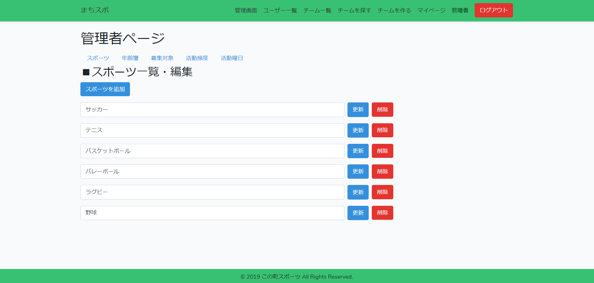
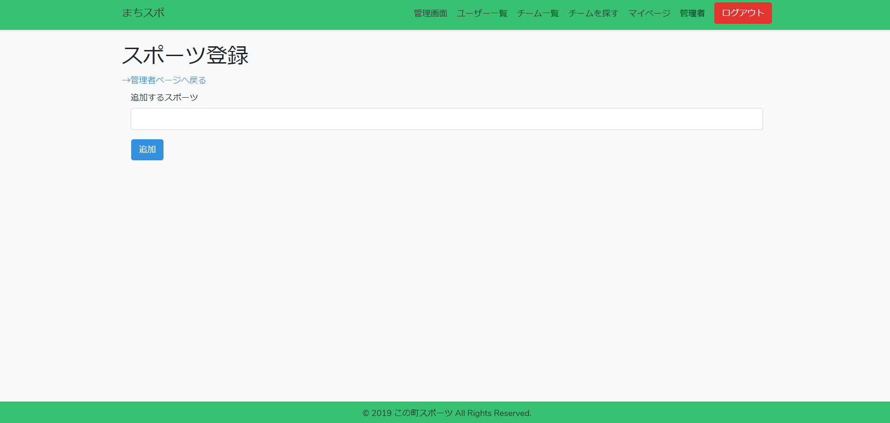
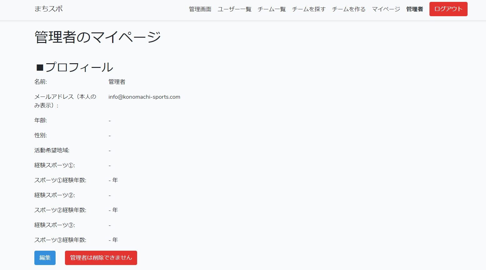
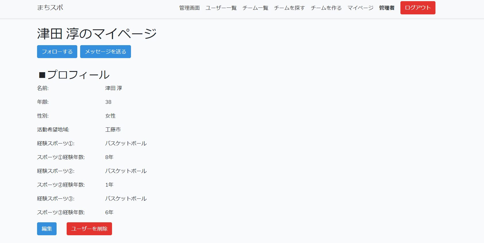
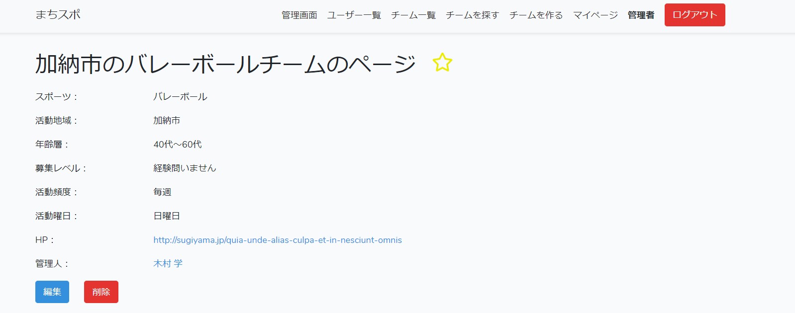

# この町スポーツ

この町スポーツ、略して「まちスポ」。  
まちスポは地域で活動しているスポーツクラブとスポーツをしたい個人をつなげるマッチングサイトです。  
テストユーザーをご準備しておりますので、そちらよりログインください。  
※機能重視のため、レスポンシブ対応はしておりませんm(_ _)m

## サイトURL
http://konomachi-sports.com

## 主な機能

1.ユーザー(user)、チーム(team)、活動状況(post)のCRUD  
2.ログイン、ログアウト、パスワードリマインダー、Eメール確認  
3.画像アップロード機能（活動状況内にて）  
4.ユーザーフォロー機能  
5.チームお気に入り登録機能  
6.ダイレクトメッセージ機能  
7.チーム検索機能（ページネーションあり）  
8.管理者機能（スポーツ、年齢層、募集対象、活動頻度、活動曜日の追加・編集・削除）  

### 管理者機能について
  
こちらは管理者画面のメインの画面です。  
各タブからそれぞれの項目の追加、更新、削除が可能です。  
「○○を追加」というボタンを押すことで、項目の追加ページに遷移します。  

  
こちらが各項目の追加画面です。  

  
こちらは管理者のマイページです。  
管理者は誤って削除できないようにしています。

  
こちらは管理者から他のユーザーのマイページへアクセスした際の画面です。  
管理者はすべてのユーザーの「編集・削除」が行えます。

  
こちらは管理者から他のユーザーが管理人をしているチームにアクセスした際の画面です。
こちらも同様にすべてのチームの「編集・削除」を行うことが可能です。

## 使用技術
- 言語/フレームワーク
    - PHP 7.2 / Laravel 5.8
- 開発環境
    - Docker for Windows
        - Laradock
- 本番環境
    - AWS  
        - Elastic Beanstalk  
        - RDS  
        - EC2
        - Route53
- 使用言語/フレームワーク
    - PHP/Laravel
- テスト（一部のみ実施）
    - phpunit
- コード整形
    - PHP-CS-Fixer
    
## 今後の課題

- 開発環境でDockerを使用したものの、理解が浅くAWSのECSを使ったデプロイには至らなかったため、Dockerの理解
- AWSもざっくりとした理解にとどまっているため、AWSを使いこなすにはもっと深い理解が必要
- わからない箇所を検索にて調べるにあたって、まだまだうまく検索をできず一つの機能の実装で時間がかかるケースが多くあったため、検索力の向上

